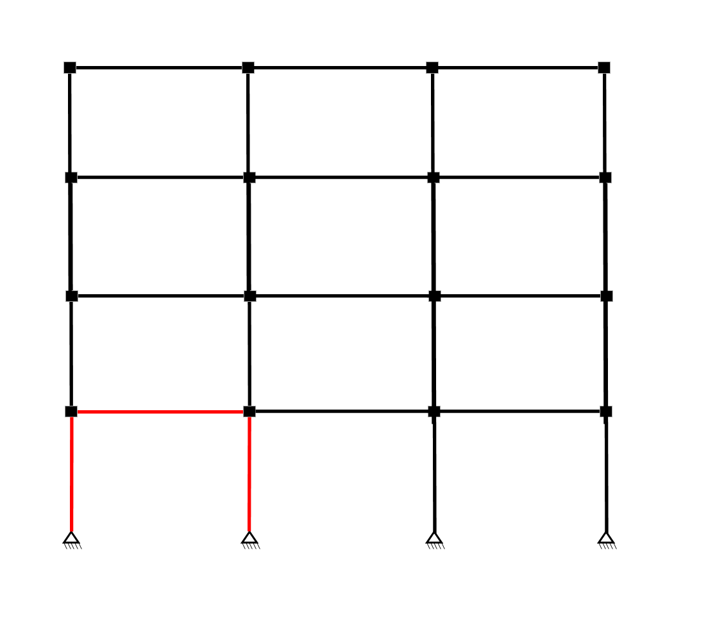

# Client-Server application for vRTHS

## Description

Reference structure

## Requirements

- Windows ? Windows 7 o superior Hola Mane
- Matlab version ?
- Simulink Real Time ?
- OpenSees ?
- OpenFresco ?
- Something else?

## Instructions

For the execution of this model, the following instructions must be followed.

### Instalation

### Simulation

Before running, the Simulink model "HybridControllerD2D2" must be open, the address in Matlab must match the address where this file is located since to start it calls a function called "initializeSimulation".

1. Open OpenFresco and type "source ServerBeam1_TCP.tcl"
2. Open OpenFresco and type "source ServerCol2_TCP.tcl"
3. Open OpenSees and type "source ServerCol1_Adapter.tcl"
4. Execute the Simulink model "HybridControllerD2D2", it will load and will be waiting. Additionally, a tab will be displayed showing the movement of the column named Col1. This is optional, if you want to delete you must modify the ServerCol1_Adapter.
5. Open OpenSees and type "source SubEstNum.tcl". This will start the process and a message will be displayed in the OpenSees window. You must press "Enter" three times for vRTHS to start.
6. Once the simulation is finished, the OpenSees and OpenFresco windows will close. Model execution in Simulink should be stopped.

### Post-processing

To check the correct performance of the vRTHS, the following steps must be followed:
1. Open the file called "PlotOutput" located in the output folder.
2. If everything was executed correctly, a series of graphs will be shown together with some tables with performance criteria.

## How to cite
