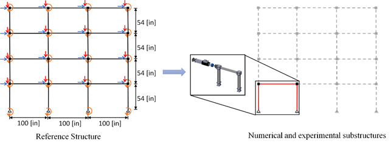
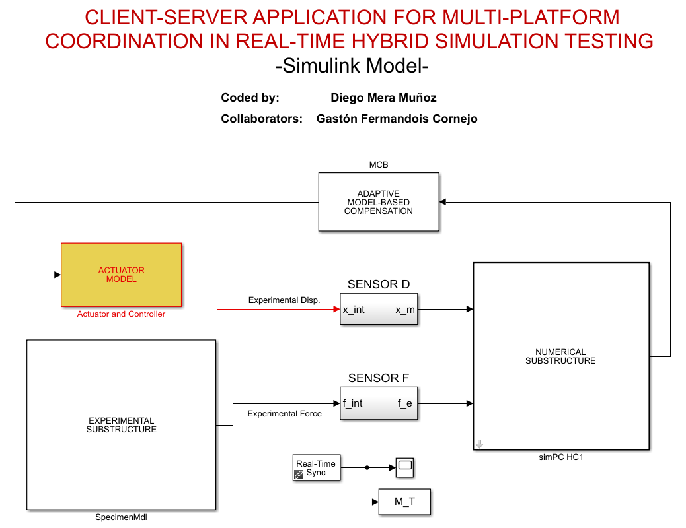
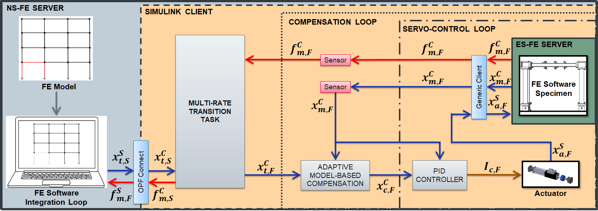
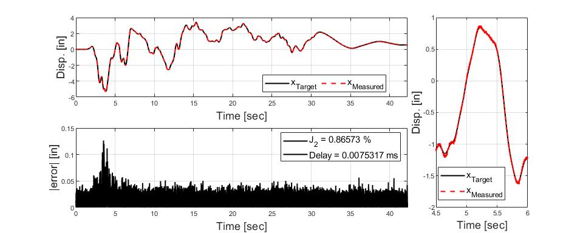

# Client-Server application for vRTHS

## Description

The example provided here is a four-story planar frame with three bays, with a total of 52 degrees of freedom (16 lateral, 16 vertical, and 20 rotational). The beams are modeled with linear elastic frame elements, while the columns are modeled with frame elements using Giuffre-Menegotto-Pinto steel material with isotropic strain hardening with an initial stiffness of 5.6 [kip/in]. Consequently, the first-mode fundamental period is T1=1.9 [s]. The reference structure is divided into the numerical substructure (NS) and experimental substructure (ES). One bay of the first story is taken as the ES, while the rest is modeled as NS. Since it is intended to work only with a uniaxial actuator, the boundary degrees of freedom are set to be only horizontal displacements.

It is important to mention that these substructures, numerical and experimental, can be replaced by the substructures desired by the user.

## How to cite
Mera, D., & Fermandois, G. (2021). "Client-Server application for vRTHS." https://doi.org/10.5281/zenodo.4646490.

## Requirements

- Windows 7 or superior
- Matlab R2020b or superior
- Simulink Desktop Real-time
- OpenSees version 3.1.0 (2016) - 64 bits
- OpenFresco version 2.7.1 (2006) - 64 bits

## Instructions

For the execution of this model, the following instructions must be followed.

## Instalation

### OpenSees

OpenSees uses Tcl/Tk (Tool Command Language), a general-purpose scripting language that has been extended with commands for OpenSees. You need to download and install Tcl/Tk before you can use OpenSees. This file can be found at the following link: [https://www.tcl.tk/software/tcltk/8.5.html](https://www.tcl.tk/software/tcltk/8.5.html "Tcl/Tk install")

I recommend downloading tcl86. First you enter the link named as follows:

    Download font versions of Tcl / Tk 8.5.19

Once the tcl version is downloaded, it must be activated. For this we enter the following link:

    Download ActiveTcl 8.5.19 binaries

With this, it should be possible to use OpenSees and all its features. In any case, working directly from the command console can be uncomfortable, so I recommend working with an editor. I recommend using CypressEditor. This can be found at the following link:

    https://cypress.hrshojaie.com/

For users who are new at OpenSees, I recommend visiting the following page. Here you can find manuals, examples, and a forum.

    https://opensees.berkeley.edu/wiki/index.php/OpenSees_User

### Real-time desktop installation

The Simulink Desktop Real-Time software requires a real-time kernel that interfaces with the operating system. Users may refere to https://www.mathworks.com/help/sldrt/ug/real-time-windows-target-kernel.html where detailed instructions on how to install Real-Time Kernel are provided. The following paragraph is a summary of the instruction provided by MathWorks. 
WARNING: Failing to run a real-time simulation without having installed the kernel may cause a major crash of the computer due to insufficient computational resources that may lead to loss of data or unsaved work.

1. Previously save all data and work and close all applications except MATLAB.
2. In the MATLAB Command Window, type: `sldrtkernel -install`. The MATLAB Command Window displays one of these messages:

       You are going to install the Simulink Desktop Real-Time kernel.
       Do you want to proceed? [y] :

4. Type y to continue installing the kernel, or n to cancel without changing the current configuration.
5. After installing the kernel, check the installation by typing: `rtwho` 
    
If installed successfully, users should see the following message: 
    
    Simulink Desktop Real-Time version xxxx (C) 
    The Mathworks, Inc. 1994-20xx 
    Running on 64-bit computer, (xxxx indicates users’ system version and year)

If their computer crashes after installing the kernel there is a patch available from Mathworks that needs to be installed. This can be downloaded directly from the Mathworks website (https://www.mathworks.com/support/bugreports/1719571).

### Mex compiler

If you do not have a Windows operating system, it will be necessary to compile the MEX files again. This can be done directly from Matlab using Matlab's own compiler, MinGW64. To use it must be installed as a complement to Matlab. Information regarding this is available at the following link: https://www.mathworks.com/matlabcentral/fileexchange/52848-matlab-support-for-mingw-w64-c-c-compiler

If you are used to working with other editors such as Visual Studio, it will be necessary to modify the selected compiler to work in Matlab. For that, the following is written in the command window:

    mex -setup
    
Then, users should see the following message: 
    
    MEX configured to use 'xxxx' for C language compilation. (xxxx indicates users’ C compiler that it's selected)
    
    To choose a different C compiler, select one from the following:
    
    MinGW64 Compiler (C)  mex -setup:'folder where the compiler is located on your computer' C
    
    Microsoft Visual C++ 2019 (C)  mex -setup:folder where the compiler is located on your computer C
    
    To choose a different language, select one from the following: 
    
    mex -setup C++ 
    
    mex -setup FORTRAN

To compile an S function in C language, enter the following command in the MATLAB command window:

    mex sfun_name.c

where `sfun_name.c` is the name of the C source file. The mex command will generate the compiler and linker commands necessary to produce the S-Function executable file. In the event of an error in the compiler, these will be displayed in the MATLAB windows.

### Simulation

Below is an image of the implementation in simulink. This image corresponds to the file CSvRTHS_Client. Although it is appreciated that the interconnections between the actors are simple, within these subsystems we worked with Goto and From blocks to send and receive signals. In this way, Simulink is seen to be cleaner, without so much connection by arrows.

A short description of each subsystem can be seen next here:

- Numerical Substructure: This block contains communication with the numerical substructure implemented in OpenSees (NumSubEst) through the OpenFresco Connect block. Additionally, inside is the implementation of the predictor-corrector method for the continuous generation of signals using polynomial extrapolation/interpolation. This algorithm is implemented in a StateFlow block in Simulink and can be obtained in the OpenFresco source code.
- Experimental Substructure: This block contains communication with the experimental substructure implemented in OpenSees (ServerCol1, ServerCol2, ServerBeam1) through TCP/IP communication. The GenericClient Element block is used for this.
- Adaptive Model-Based Compensation: In this block is the implementation of the compensation method to be used. In this case the Adaptive Model-Based Compensation method.
- Actuator Model: Inside this block is the implementation of the actuator model to be used in conjunction with its controller. In this case a P control is used.
- Sensors: As its name indicates, the sensors are located inside. Being a virtual simulation, the function of these blocks is to introduce noise to the measurement to simulate a real sensor. This noise is generated from band-limited white noise.

Additionally, the Real-Time Sync block is appreciated, this block synchronizes the Simulink model with the real-time kernel clock and ensures that it does not run faster than the user-specified simulation rate. 

The implementation of CSvRTHS is illustrated in the next figure. Briefly, the first requirement is to start the ES-FE server, which is waiting for the resolution to start. Then, Simulink Client must be executed (The integration scheme used in Simulink was ode8 (Dormand-Prince)), which requests a displacement to OpenSees for the execution of the first temporary step. So finally, the OpenSees file (NS-FE Server) that contains the NS and where the integration of the equation of motion is performed is executed. An explicit integration scheme, as Newmark Explicit, is recommended. Here the sampling intervals used for the fast and slow processes are 1/1024 and 2/100 [s], respectively. To summarize, the loops need to be run from the inside to the outside layers: (1) ES-FE server (green); (2) Simulink client (orange); and (3) the NS-FE server (blue-gray).

Before running, the Simulink model `CSvRTHS_Client.slx` (located at the source file) must be open, the address in Matlab must match the address where this file is located since to start it calls a function called "initializeSimulation".

1. Open OpenFresco and type `source ServerBeam1_TCP.tcl`
2. Open OpenFresco and type `source ServerCol1_TCP.tcl`
3. Open OpenFresco and type `source ServerCol2_TCP.tcl`
4. Execute the Simulink model `CSvRTHS_Client.slx`, it will load and will be waiting.
5. Open OpenSees and type `source SubEstNum.tcl`. This will start the process and a message will be displayed in the OpenSees window. You must press "Enter" three times for vRTHS to start.
6. Once the simulation is finished, the OpenSees and OpenFresco windows will close. Model execution in Simulink should be stopped.

### Post-processing

To check the correct performance of the vRTHS, the following steps must be followed:
1. Open the file called `PlotOutput.m` located in the output folder (folder created by the NS in OpenSees, the name its selectec by the user).
2. If everything was executed correctly, a series of graphs will be shown together with some tables with performance criteria.

Let J2 be the Normalized root mean square of the
tracking error and τ the time delay between the input and output signals evaluated at the equivalent frequency.

In the example provided, the measured displacement is compared to the target displacement for the evaluation of the compensation method. With J2  = 0.866 [%] and τ = 0.0075 [msec], a good tracking is achieved, which allows a stable test. Furthermore, it is noticeable that practically all the error obtained (J2) is due to the noise considered in the sensors at the time of measurement.

